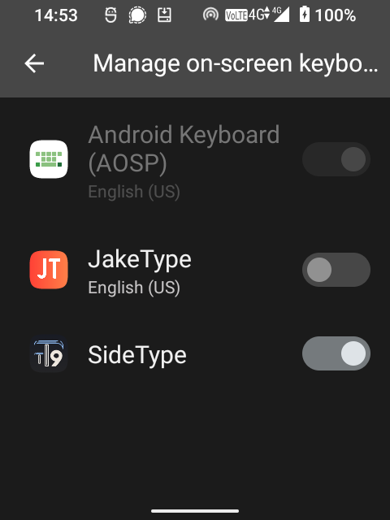
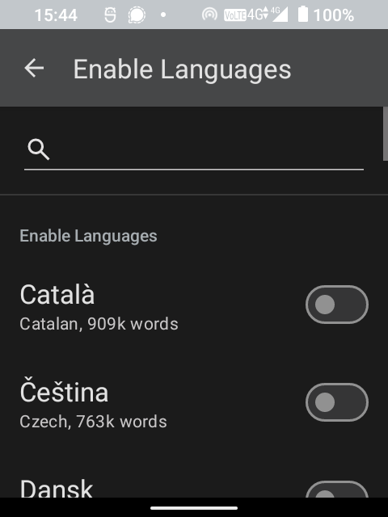
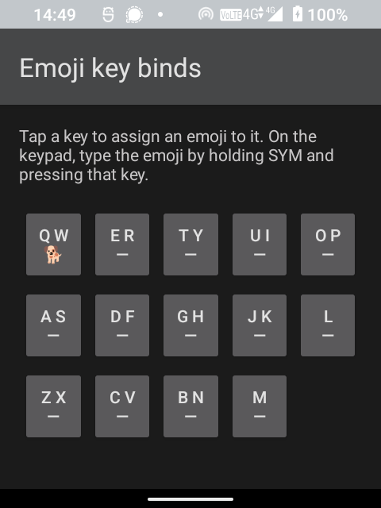
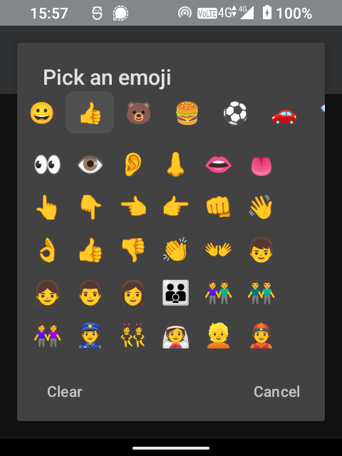

# SideType ⌨️

**Predictive text in your language for the Sidephone Compact QWERTY tile.**

SideType is a free, open-source keyboard (an Android "input method") for the
[Sidephone SP-01](https://sidephone.com) when it's fitted with the swappable **Compact QWERTY**
keypad tile. It gives you smart, predictive typing in **30+ languages** — every Latin-script language,
including proper **å ä ö** and other accented letters that no other Compact QWERTY keyboard can
produce.

> **In one sentence:** the tile in your hands only knows English; SideType teaches it every other
> language, without you having to touch the screen.

<!-- Placeholder hero: the SideType on-screen strip (in Finnish). Replace with a photo of the SP-01 +
     Compact QWERTY tile showing live predictions when you have one — save as screenshots/sidephone/hero.png
     and point the img below at it. -->
<p align="center"></p>

---

## 📖 Table of contents

- [Why SideType exists](#-why-sidetype-exists)
- [What it can do](#-what-it-can-do)
- [How the typing works (the important idea)](#-how-the-typing-works-the-important-idea)
- [The keys, explained](#-the-keys-explained)
- [Languages](#-languages)
- [Install it](#-install-it)
- [First-time setup](#-first-time-setup)
- [Everyday tips](#-everyday-tips)
- [For developers: build from source](#-for-developers-build-from-source)
- [How it's built (under the hood)](#-how-its-built-under-the-hood)
- [What's new](#-whats-new)
- [Found a bug?](#-found-a-bug)
- [Credits & attribution](#-credits--attribution)
- [License](#-license)

---

## 🤔 Why SideType exists

The Sidephone SP-01 has a clever swappable keypad. One of the tiles is a **Compact QWERTY** — a
BlackBerry-style keyboard where **each key carries two letters** (Q/W, E/R, T/Y, and so on). There
aren't enough keys for every letter, so the phone has to _guess_ which of the two you meant. That
guessing is the keyboard's job.

The Sidephone team makes a lovely predictive keyboard for the tile, **JakeType**, and it's great — but
it's English-only. It doesn't type **å, ä, ö, é, ü, ñ, ç** or the other accented characters that most
languages need. I write in Finnish every day, so that was a dealbreaker for me: without ö and ä, the
tile just couldn't keep up with how I actually type.

And here's the thing about a two-letters-per-key keyboard: **the prediction _is_ the keyboard.** With
only half the keys of a normal layout, every keypress is ambiguous, so the whole experience lives or
dies on how good the guessing is. Good predictive text is what turns a cramped, ambiguous keypad into
something you can actually type fast on without looking — it's the hard part, and it's the magic. Doing
that well in _one_ language is a real feat; doing it in **30+ languages, each with its own words,
spelling, and accents,** is a much bigger one.

So SideType was built to bring exactly that: **the same effortless, genuinely smart predictive typing —
but in your language, with your accents, for free, and open for anyone to inspect or improve.**

<!-- SCREENSHOT STUB: side-by-side — English-only typing vs. SideType typing the Finnish "työ" with ö.
     Save as screenshots/sidephone/before-after.png -->

---

## ✨ What it can do

- **Predictive typing on the Compact QWERTY tile.** Tap the keys for the word you want and SideType
  works out which of each key's two letters you meant, then offers the most likely words.
- **Real accented letters.** å, ä, ö, é, ü, ñ, ç and more — no special keys needed. They "ride along"
  on the nearest normal letter (see below).
- **30+ languages**, switchable in the app — every Latin-script language TT9 supports. Finnish,
  Swedish, German, French, Spanish, Italian, Estonian, Polish, Turkish, Czech, Hungarian, and many more.
- **Case control** — cycle a word between `abc`, `Abc`, and `ABC` with one key.
- **Numbers & symbols** — press-and-hold any letter key for its number or symbol; a dedicated symbols
  page and an emoji page are one keypress away.
- **Emoji shortcuts you choose.** Pin your favourite emoji to individual keys and drop them in
  instantly.
- **A personal dictionary.** Teach it words it doesn't know (names, slang, brand names) and it
  remembers them.
- **Completely private.** No tracking, no ads, no accounts, works fully offline. Nothing you type
  ever leaves the phone.

<!-- SCREENSHOT STUB: the on-screen suggestion strip with the "+" (add word) and 🙂 (emoji) buttons.
     Save as screenshots/sidephone/status-bar.png -->
<p align="center"></p>

---

## 💡 How the typing works (the important idea)

If you've never used a "two letters per key" keyboard, here's the whole concept in 30 seconds.

Each key has **two letters** printed on it, e.g. the top-left key is **Q W**. When you press it,
SideType doesn't yet know whether you meant `q` or `w` — so it keeps _both_ possibilities open. As you
press more keys, it compares the whole pattern against a dictionary of real words and shows you the
matches, most-likely first.

**Example — typing "test":**

1. Press **T Y** → could be `t…` or `y…`
2. Press **E R** → `te`, `tr`, `ye`, `yr`…
3. Press **A S** → …narrowing down…
4. Press **T Y** → SideType shows **test** at the top.

Press **space** to accept it. You never had to tell it "I meant T, not Y" — the prediction figured
it out. This is exactly how the classic Nokia "T9" keyboards worked, and it's fast once your thumbs
learn it.

**Accents ride along.** Accented letters don't get their own keys — they sit on the key of their
plain cousin. In Finnish, **ä** and **å** live on the **A S** key, and **ö** lives on the **O P** key.
So typing the keys for "aiti" can produce **äiti**, and "tyo" can produce **työ** — the keyboard picks
the accented spelling because that's the real word. You get correct spelling for free.

If prediction ever guesses wrong, you can **press the same key again** to step through its letters
manually (this is called _multi-tap_, like old phones), or scroll the suggestion list.

<!-- SCREENSHOT STUB: an animated GIF or sequence showing "aiti" keys turning into "äiti".
     Save as screenshots/sidephone/ride-along.gif -->

---

## 🎹 The keys, explained

Here's what every key on the Compact QWERTY tile does in SideType.

### Letter keys

Each key types one of its two letters (prediction decides which), plus any accented letters that
belong to it in your language.

| Key | Normal letters | Also produces (examples) |
| --- | -------------- | ------------------------ |
| Q W | q · w          |                          |
| E R | e · r          | é è ê (French)           |
| T Y | t · y          |                          |
| U I | u · i          | ü ù û ï (German/French)  |
| O P | o · p          | **ö** ø œ                |
| A S | a · s          | **ä å** à â ß æ          |
| D F | d · f          | ð                        |
| G H | g · h          |                          |
| J K | j · k          |                          |
| L   | l              | ł                        |
| Z X | z · x          |                          |
| C V | c · v          | ç                        |
| B N | b · n          | ñ                        |
| M   | m              |                          |

_(Which accents appear depends on the language you've selected.)_

### Function keys

| Key             | Tap it                                   | Hold it                                                                  |
| --------------- | ---------------------------------------- | ------------------------------------------------------------------------ |
| **Space**       | Accept the top suggestion / add a space  | Type `0`                                                                 |
| **⌫ Backspace** | Delete                                   | —                                                                        |
| **↵ Enter**     | Confirm / new line                       | —                                                                        |
| **aA** (Shift)  | Cycle case: `abc → Abc → ABC`            | —                                                                        |
| **SYM** (✱＋)   | Open the **symbols** page                | Hold **SYM + a letter key** = insert the emoji you pinned to that key    |
| **▲▼** (arrows) | Scroll through the suggestions / symbols | Switch to manual _multi-tap_ mode (to reach every accent by hand)        |
| **letter keys** | _(type letters, above)_                  | Type that key's **number or symbol** (the small character printed on it) |

So the small grey character printed on each key — a number or a symbol — comes out when you
**press and hold** that key. No mode-switching required for a quick digit.

<!-- SCREENSHOT STUB: close-up of the tile with callouts pointing at aA, SYM, and the arrow keys.
     Save as screenshots/sidephone/key-guide.png -->

---

## 🌍 Languages

SideType inherits all **40+ language dictionaries** from Traditional T9 (the project it's built on).
Every **Latin-script language — about 30 of them — works today**, each with its own accents mapped onto
the right keys:

> English, Finnish, Swedish, German, French, Spanish, Italian, Portuguese (PT & BR), Dutch, Danish,
> Norwegian, Catalan, Estonian, Latvian, Lithuanian, Polish, Czech, Slovak, Slovenian, Croatian,
> Hungarian, Romanian, Turkish, Irish, Indonesian, Kiswahili, Toki Pona, Tamazight (Latin), Hinglish.

**Only these supported languages appear in the app's language list** — the un-converted ones are hidden
so you can't accidentally pick a language that won't type on the tile.

> ⚠️ **Early release — expect rough edges.** The Compact QWERTY layouts and accents were generated
> automatically for _every_ Latin language and validated at build time, but only a few (English, Finnish,
> German) have been typed out by hand so far. A given language could still have a misplaced accent or an
> odd prediction. If you find one, please **[report it](#-found-a-bug)** — it's usually a one-line fix.

Non-Latin scripts (Russian, Greek, Arabic, Hindi, …) and **Vietnamese** (its stacked tone marks need a
bespoke layout) aren't converted yet, so they don't appear in the list. The dictionaries are bundled and
ready — each just needs a key layout drawn up. Contributions very welcome.

You switch languages right from the keyboard: enable several, then tap the language chip (`EN` / `FI` …)
on the on-screen strip to hop between them.

---

## 📲 Install it

> **Note:** SideType is a normal keyboard app you install — it sits alongside any other keyboards on
> the phone (including JakeType, if you've installed that) and removes nothing. You choose which
> keyboard is active whenever you like, and you can always switch back.

### The easy way (pre-built app)

1. Download the latest `SideType.apk` from the [Releases page](../../releases).
2. Copy it to your Sidephone and open it to install. (You may need to allow "install from unknown
   sources" — Android will prompt you.)
3. Open **Settings → System → Languages & input → On-screen keyboard** (wording varies), and
   **enable SideType**.
4. Then **switch to** SideType as your current keyboard.

<!-- SCREENSHOT STUB: Android keyboard picker showing "SideType" in the list.
     Save as screenshots/sidephone/keyboard-picker.png -->
<p align="center"></p>

### Getting updates automatically

For hands-off updates, install **[Obtainium](https://github.com/ImranR98/Obtainium)**, add this repo's
URL, and it will notify you whenever a new release is published — no app store needed. (A plain APK
download works too; you just won't get update notifications.)

If you'd rather build it yourself, see [For developers](#-for-developers-build-from-source) below.
Maintainers cutting a release: see [`RELEASE.md`](RELEASE.md).

---

## 🚀 First-time setup

The first time you use SideType:

1. **Pick your language** and let it load the dictionary. (You'll see a short "Loading…" message the
   first time a language is used — it's preparing the word list. This only happens once per language.)
2. **Enable a second language** (optional) if you write in more than one — a small **language chip**
   (e.g. `EN` / `FI`) then appears on the on-screen strip.
3. **Start typing.** Tap the keys for your word and watch the suggestion bar.
4. Learn the handy buttons on the on-screen strip:
   - **⚙** (far left) — open SideType settings.
   - **+** (left) — add the word you just typed to your personal dictionary, or type in a brand-new
     word to teach it.
   - **EN / FI …** (right, when 2+ languages are enabled) — **tap to switch writing language.**
   - **🙂** (far right) — open the emoji screen, where you can also **pin emoji to keys**.

<!-- SCREENSHOT STUB: settings screen where a language is selected/loaded.
     Save as screenshots/sidephone/language-setup.png -->
<p align="center"></p>

---

## 💬 Everyday tips

- **Switch language:** tap the **language chip** (`EN` / `FI` / `DE` …) on the on-screen strip to hop
  to the next enabled language. (It only shows once you've enabled two or more.)
- **Accept fast:** the **space** bar takes the top suggestion — you rarely need to look down.
- **Wrong guess?** Use the **▲▼ arrows** to scroll to the word you meant, or hold **▲▼** to switch to
  manual letter-by-letter typing for that word.
- **Need a number quickly?** Hold the letter key — the printed digit comes straight out.
- **Symbols:** tap **SYM** for the full symbols page; scroll it with the arrows.
- **Emoji you use a lot:** open the 🙂 screen, tap a key in the grid, and pick an emoji to pin to it.
  From then on, **hold SYM and press that key** to drop the emoji instantly.
- **Names it doesn't know:** type them once and hit **+** to remember them.

<!-- SCREENSHOT STUB: the emoji key-binding grid (mirrors the physical tile layout).
     Save as screenshots/sidephone/emoji-binds.png -->
<p align="center">
  
  
</p>

---

## 🛠 For developers: build from source

SideType is a fork of [Traditional T9](https://github.com/sspanak/tt9). Building it produces an
installable `.apk`.

### You'll need

- **JDK 21** to _run_ the build (the build script uses a Java 19+ feature). The app itself still
  compiles to Java 17.
- **Android SDK** with platform **android-36** and recent build-tools/platform-tools.
- A Sidephone (or any Android device) with **USB debugging** on, plus `adb`.

### Build the app

```bash
git clone https://github.com/oliverpalonkorp/SideType.git
cd SideType

export JAVA_HOME=/path/to/jdk-21
export ANDROID_HOME="$HOME/Library/Android/sdk"
export ANDROID_SDK_ROOT="$ANDROID_HOME"

./gradlew :app:assembleFullDebug --no-daemon
# → app/build/outputs/apk/full/debug/*-full-debug.apk
```

**Notes**

- Build the **`full`** flavour (`assembleFullDebug`). It bundles every dictionary and is
  self-contained — ideal for putting on a device. _(The `lite` flavour has an upstream compile issue;
  don't build it.)_
- The **first** build is slow (~10–20 min — it compiles hundreds of MB of dictionaries). Later builds
  are quick (Java-only changes rebuild in under a minute). Changing a language's layout re-compiles
  just that language's dictionary.
- **Let builds finish** — never interrupt one midway.

### Install & enable via adb

```bash
adb install -r app/build/outputs/apk/full/debug/*-full-debug.apk
adb shell ime enable fi.palonkorpi.sidetype/io.github.sspanak.tt9.ime.TraditionalT9
adb shell ime set    fi.palonkorpi.sidetype/io.github.sspanak.tt9.ime.TraditionalT9
```

See [`docs/sidephone/BUILD.md`](docs/sidephone/BUILD.md) for the full, tested recipe and troubleshooting.

---

## 🔧 How it's built (under the hood)

_For the curious. You don't need any of this to use SideType._

The clever part of predictive typing — matching your key presses against a dictionary and ranking the
likely words — is a **solved problem**. [Traditional T9](https://github.com/sspanak/tt9) already does
it beautifully for 40+ languages, using a word-frequency dictionary and an "n-gram" model (which
learns which words tend to follow which) for each language.

The catch: TT9 was built for the classic **12-key numeric keypad** (where each key holds 3–4 letters).
The Sidephone tile is a different shape — **14 keys with 2 letters each**. So SideType keeps TT9's
prediction approach and its word-frequency / n-gram language data, widens the engine's internal key
encoding from 12 to 16 keys so the extra keys fit, and adds:

1. **A new "Compact QWERTY" input mode** that listens for the tile's 14 letter keys (and its Shift,
   SYM, and arrow keys) instead of a numeric pad.
2. **Per-language key layouts** that place each language's letters — and its accents — onto the right
   keys. For Latin languages this follows a simple rule: every accented letter rides along on the key
   of its plain base letter (ä/å → the A key, ö → the O key, é → E, ç → C, and so on), so most
   languages work with a tiny data change and no new code.
3. **Sidephone-friendly controls** — the physical Shift/SYM/arrow keys wired to case-cycling, a
   symbols page, emoji, and suggestion scrolling; plus quality-of-life extras like pin-an-emoji-to-a-key
   and an in-keyboard "add word" dialog.

Adding a new Latin language is usually just a small change to that language's layout file — no new
code. The build then re-encodes that one language's dictionary to match the new key layout (the
word lists and frequencies themselves are untouched). The full technical background lives in the
design notes in [`docs/sidephone/`](docs/sidephone):
[`PRD.md`](docs/sidephone/PRD.md), [`COMPACT_QWERTY_KEYMAP.md`](docs/sidephone/COMPACT_QWERTY_KEYMAP.md),
and [`M1-DESIGN.md`](docs/sidephone/M1-DESIGN.md).

---

## 📝 What's new

The latest release is **v1.1** — an emoji & symbol drawer, bindable symbol keys, and a download
that's ~7× smaller (219 MB → 32 MB) with languages fetched on demand. Full history in
[`CHANGELOG.md`](CHANGELOG.md); signed APKs on the
[Releases page](https://github.com/oliverpalonkorp/SideType/releases).

---

## 🐞 Found a bug?

SideType is young and maintained by one person in their spare time, so bugs are expected — the most
likely being:

- a **wrong or missing accent** in a specific language,
- a **prediction** that ranks words oddly,
- anything that **crashes** or behaves unexpectedly.

Please open an issue: **[github.com/oliverpalonkorp/SideType/issues](https://github.com/oliverpalonkorp/SideType/issues)**.
It helps to include:

1. Your **language**, what keys you pressed, and what you expected vs. what you got.
2. Your **Sidephone model and Android version** (Settings → About phone).
3. A **screenshot**, if it's something you can see.

Feature ideas and pull requests are welcome too — especially new language layouts (see the design notes).

---

## 🙏 Credits & attribution

SideType stands entirely on the shoulders of **[Traditional T9](https://github.com/sspanak/tt9)** by
[sspanak](https://github.com/sspanak), itself a modernization of the
[original Traditional T9](https://github.com/Clam-/TraditionalT9) by Clam-. All of the prediction
engine, the language dictionaries, and the keyboard framework are their work. SideType only adapts it
to the Sidephone Compact QWERTY tile. **Huge thanks** to those projects and their contributors.

If you want to improve the underlying engine, dictionaries, or add words to a language, the upstream
[Traditional T9 contribution guide](CONTRIBUTING.md) is the place — improvements there flow back to
everyone.

---

## 🕮 License

SideType is open source under the **Apache License 2.0** — the same license as Traditional T9. See
[`LICENSE.txt`](LICENSE.txt).
Language dictionaries carry their own licenses, documented in [`docs/dictionaries`](docs/dictionaries).

You're free to use, study, modify, and share it. If you build on SideType, please keep it open and
carry this attribution forward. ❤️
